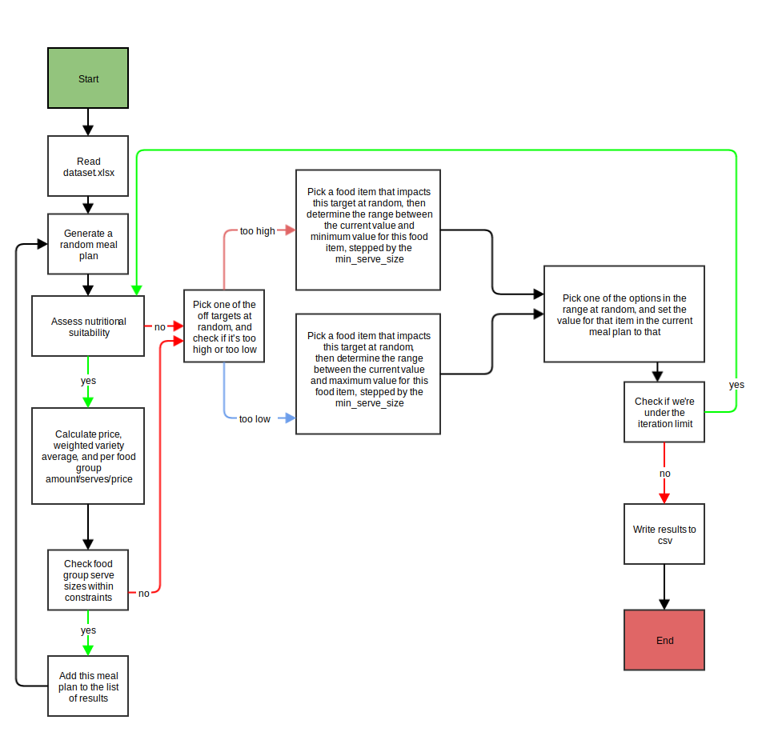

# Introduction

Dietcoster is an iterative, multiple solution solver that finds meal plans that fit various constraints.

# Installation

`pip install -r requirements.txt`

# Configuration

Edit dataset.xlsx as required

# Running

Run meal_planner.py if you wish to see results via command line, or web_server.py to run the web interface on port 8080

# Algorithm diagram

